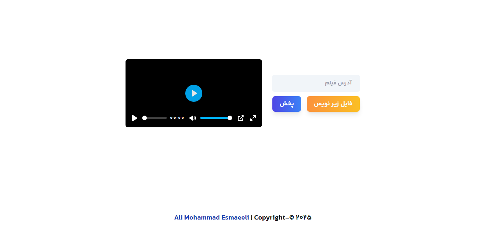

# VideoPlayer App

A simple React video player app with subtitle support, built using [plyr-react](https://github.com/sampotts/plyr) and [NextUI](https://nextui.org/).

---



## Features

- **Play any video by URL** (MP4 format recommended)
- **Upload and display subtitles** (`.srt` or `.vtt` files)
- **Modern UI** with [TailwindCSS](https://tailwindcss.com/) and NextUI
- **Customizable controls** (play, pause, volume, captions, fullscreen, etc.)
- **Persian (Farsi) UI labels** for player controls

---

## How It Works

1. **Video Input**:  
   Enter the URL of your video in the input box. The player will load and display the video.

2. **Subtitle Upload**:  
   Click the "فایل زیر نویس" button to select a subtitle file (`.srt` or `.vtt`). The subtitle will be loaded and shown on the video.

3. **Play/Pause Button**:  
   Use the "پخش/توقف" button to play or pause the video. The button label changes based on the current state.

4. **Player Controls**:  
   The player includes controls for play, pause, progress, current time, mute, volume, captions, settings, picture-in-picture, and fullscreen.

---

## Main Technologies

- **React** (with hooks)
- **plyr-react** for the video player
- **NextUI** for buttons
- **TailwindCSS** for styling

---

## File Structure

- `src/App.tsx` — Main React component containing all logic and UI

---

## Key Code Sections

### 1. State and Refs

```tsx
const [video, setVideo] = useState("");
const [isPlaying, setIsPlaying] = useState(false);
const playerRef = useRef<any>(null);
const [subtitle, setSubtitle] = useState("");
const fileInputRef = useRef<HTMLInputElement>(null);
```

### 2. Video Source Object

```tsx
const videoSrc = {
  type: "video",
  sources: [{ src: video, type: "video/mp4" }],
  tracks: subtitle
    ? [
        {
          kind: "subtitles",
          label: "زیرنویس",
          src: subtitle,
          srclang: "fa",
        },
      ]
    : [],
};
```

### 3. Plyr Player

```tsx
<Plyr
  ref={playerRef}
  source={videoSrc}
  options={{
    autoplay: false,
    controls: [
      "play-large",
      "play",
      "progress",
      "current-time",
      "mute",
      "volume",
      "captions",
      "settings",
      "pip",
      "fullscreen",
    ],
    settings: ["captions"],
    i18n: {
      // Persian labels for controls
    },
  }}
/>
```

### 4. Play/Pause Button

```tsx
<Button
  onPress={() => {
    const plyrInstance = playerRef.current?.plyr;
    if (plyrInstance) {
      if (isPlaying) {
        plyrInstance.pause();
      } else {
        plyrInstance.play();
      }
      setIsPlaying(!isPlaying);
    }
  }}
>
  <p>{isPlaying ? "توقف" : "پخش"}</p>
</Button>
```

---

## Custom Styling

To apply rounded corners to the player, add this to your global CSS:

```css
.plyr--video,
.plyr__video-wrapper,
.plyr__poster {
  border-radius: 0.5rem !important;
  overflow: hidden;
}
```

---

## Troubleshooting

- **If you see an error about `prop-types` not found:**  
  Run `npm install prop-types` in your project directory.

- **If the play/pause button doesn't work:**  
  Make sure you are using the correct ref and accessing the Plyr instance as shown above.

---

## Credits

- [Plyr](https://github.com/sampotts/plyr)
- [plyr-react](https://github.com/chintan9/plyr-react)
- [NextUI](https://nextui.org/)
- [TailwindCSS](https://tailwindcss.com/)

---

## License

MIT

---
